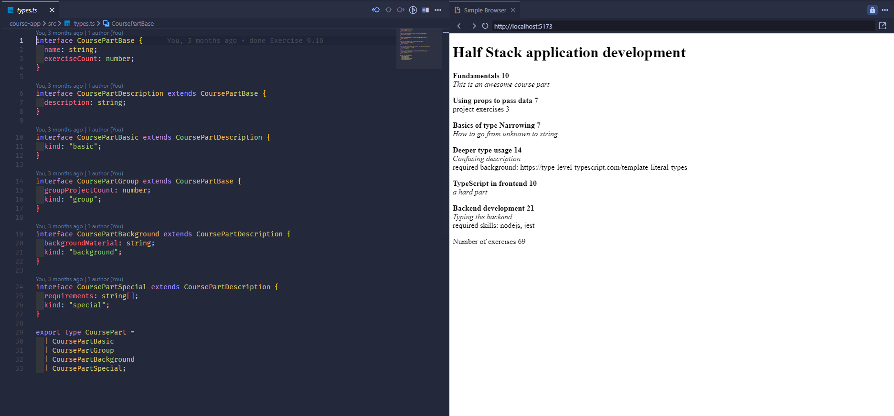
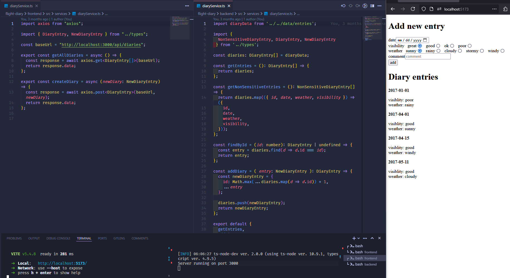
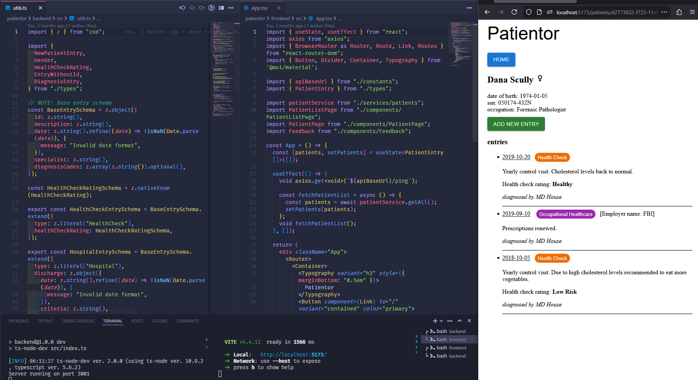

# Full Stack Open: TypeScript

This project is part of the Full Stack Open course. The course covers modern web development with TypeScript, React, Node.js, linting, and more.

## Projects

### Introduction

Basic exercises to get started with TypeScript.

- **Technologies**: TypeScript
- **Directory**: `introduction/`

#### How to Run

1. Navigate to the `introduction` directory:
    ```sh
    cd introduction
    ```
2. Install dependencies:
    ```sh
    npm install
    ```
3. Run the TypeScript files:
    ```sh
    npm run calculateBmi <height-in-cm> <weight-in-kg>
    npm run calculateExercises <target-rating> <exercise-hours-per-day>
    ```
      #### Example

      ```sh
        npm run calculateBmi 180 72
        npm run calculateExercises 2 1 0 2 4
      ```
#### How to Run using Express

1. Run the Express server `index.ts`:
    ```sh
    npm run start
    ```
2. a) Open the browser and navigate to `http://localhost:3003/bmi?height=<height-in-cm>&weight=<weight-in-kg>` to calculate BMI.

    #### Example
    ```
    http://localhost:3003/bmi?height=180&weight=72
    
    JSON Response (result):
    {
      "weight": "72",
      "height": "180",
      "bmi":"Normal weight"
    }
    ```
2. b) Using [Postman](https://www.postman.com/) or [REST Client](https://marketplace.visualstudio.com/items?itemName=humao.rest-client), send a POST request to http://localhost:3003/exercises with the following JSON body:
    ```json
    {
      "daily_exercises": [<exercise-hours-per-day>],
      "target": <target-rating>
    }
    ```

    #### Example
    ```
    http://localhost:3003/exercises

    JSON Body:
    {
      "daily_exercises": [1, 0, 2, 0, 3, 0, 2.5],
      "target": 2.5
    }

    JSON Response (result):
    {
      "periodLength": 7,
      "trainingDays": 4,
      "success": false,
      "rating": 1,
      "ratingDescription": "I'm sorry...",
      "target": 2.5,
      "average": 1.2142857142857142
    }
    ```

### Course App

A simple application to manage course information.

- **Technologies**: React, TypeScript, CSS
- **Directory**: `course-app/`

#### How to Run

1. Navigate to the `course-app` directory:
    ```sh
    cd course-app
    ```
2. Install dependencies:
    ```sh
    npm install
    ```
3. Start the development server:
    ```sh
    npm run dev
    ```
#### Screenshot(s)



### Flight Diary

An application to log and manage flight information.

- **Technologies**: React, Node.js, Express, MongoDB
- **Directory**: `flight-diary/`

#### How to Run

1. Navigate to the `backend/` directory:
    ```sh
    cd flight-diary/backend
    ```
2. Install dependencies:
    ```sh
    npm install
    ```
3. Start the backend server:
    ```sh
    npm run dev
    ```
4. Navigate to the `frontend/` directory:
    ```sh
    cd ../frontend
    ```
5. Install dependencies:
    ```sh
    npm install
    ```
6. Start the frontend development server:
    ```sh
    npm run dev
    ```
#### Screenshot(s)



### Patientor

A full-stack application to manage patient information.

- **Technologies**: React, Node.js, Express, TypeScript
- **Directory**: `patientor/`

#### How to Run

1. Navigate to the `backend/` directory:
    ```sh
    cd patientor/backend
    ```
2. Install dependencies:
    ```sh
    npm install
    ```
3. Start the backend server:
    ```sh
    npm run dev
    ```
4. Navigate to the `frontend/` directory:
    ```sh
    cd ../frontend
    ```
5. Install dependencies:
    ```sh
    npm install
    ```
6. Start the frontend development server:
    ```sh
    npm run dev
    ```

#### Screenshot(s)



## Learn More

For more information about the Full Stack Open course, visit the [course website](https://fullstackopen.com/en/part9/background_and_introduction).